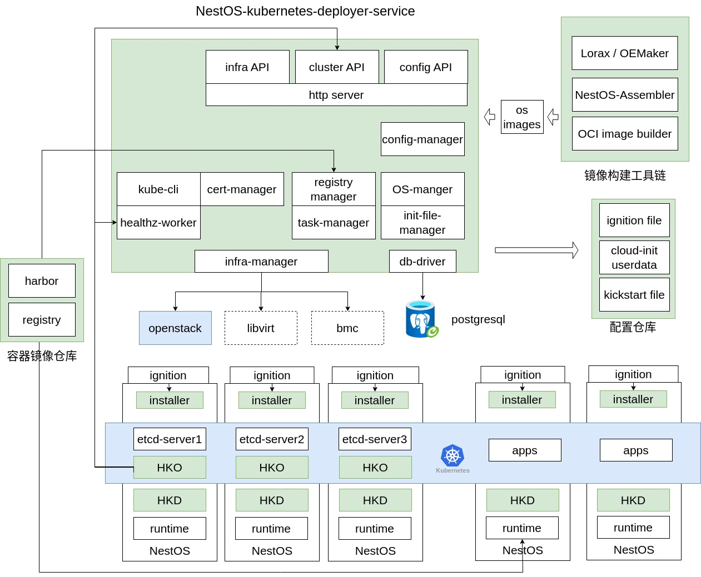

# Project design

## Overall architecture

Module description:
- http server：Provides a user interactive HTTP interface and a user-friendly frontend management interface, allowing users to easily operate and configure.
- infra-manager：Responsible for creating and deleting infrastructure.
- config-manager：Manages cluster configuration information, including operations such as creating, updating, and deleting.
- cert-manager：Responsible for creating and updating cluster and node certificates, maintaining system security, ensuring the validity and compliance of certificates.
- healthz-worker：Real-time monitoring of the system's health status, timely detection and reporting of issues, ensuring stable, reliable system operation.
- installer：Executes tasks during the system ignition phase, responsible for deploying and creating K8S clusters.
- HKO (Housekeeper Operator)：Deployed in the cluster, responsible for cluster-level operations.
- HKD (Housekeeper Daemon)：Integrated into the NestOS image, is part of HKO.
- Image building Toolchain: Toolchain used to build NestOS images, supporting custom image generation for the system.
- Configuration Repository: Database for storing and managing configuration information.
- Container Image Repository: Used to store and manage container images for private deployment, ensuring the reliability and security of applications.

Note: http server, healthz-worker, and the configuration repository are not currently supported.

## Detailed design
NKD module interaction diagram

### config-manager module design
The NKD cluster deployment provides different ways of applying configuration to facilitate the use of this deployment tool by different users:
 - Experience deploying a basic cluster: Deploy a small cluster with only one master and worker node, using default configuration parameters. This allows for direct execution of deployment commands without adding any configuration items.
 - Fine-tune configuration parameters: Deploy a highly available cluster by applying configuration through applying an configuration file.
 - Flexibly configure the cluster: Deploy a highly available cluster by adding command-line parameters.

Command-line parameters take precedence over configuration files. If both configuration files and command-line parameters are used for cluster deployment and they have overlapping configuration items, the command-line parameters will override the configuration file contents.
If users do not specify configuration parameters, NKD will either generate the parameter automatically or use default configurations, such as cluster certificates, Ignition files, etc. The config-manager module manages all configuration parameters of the cluster and stores them on disk. The NKD deployment cluster dependencies are as follows:

### cert-manager module design
NKD relies on certificates for the creation of cluster nodes and access to resources. It creates certificates outside the cluster and stores the CA certificate and admin.conf file locally. For more details, please refer to the [design document](./certmanager_design.md). The created certificates are written to the node machines via Ignition files. The certificate creation process is as follows:

### Ignition module design
When creating the infrastructure, NKD needs to pass the dynamic configuration required after system deployment through the ignition mechanism to support user deployment of Kubernetes resources. The ignition mechanism can convert user-written configuration files into configuration files used during machine boot. For immutable infrastructure operating systems, the ignition module will generate Ignition files. If the underlying operating system is a general-purpose operating system, a cloudinit file will be generated when deploying the cluster on a virtualization platform, while a kickstart file will be generated when deploying the cluster on a bare metal platform. For more details, see the [design document](./ignition_design.md).

### housekeeper module design
During the cluster deployment phase, users can choose whether to deploy housekeeper.
For more details, please refer to the [design document](./housekeeper_design.md).
