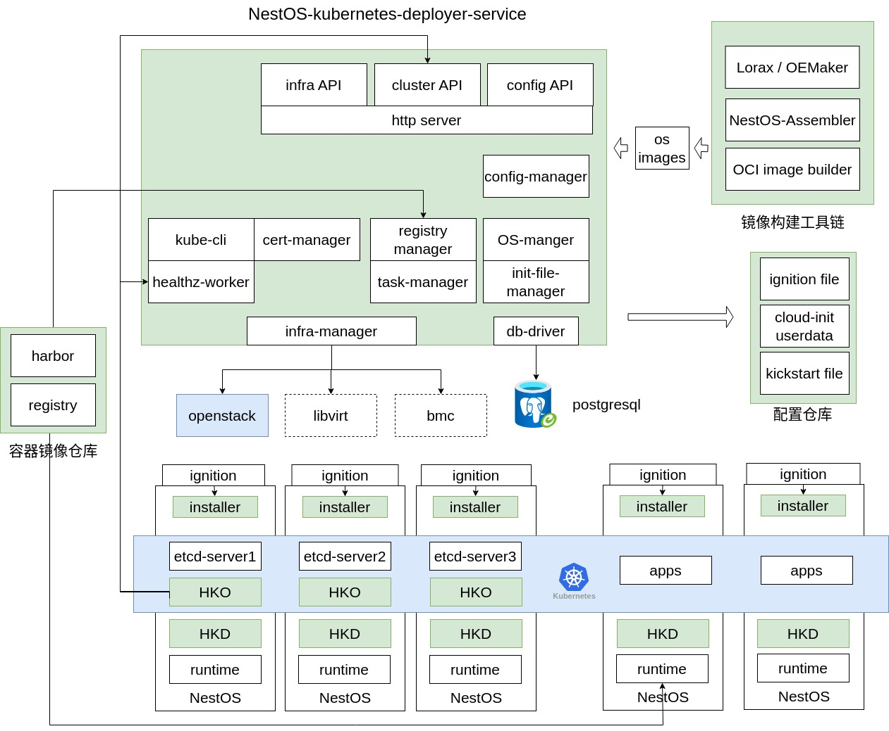

# 方案设计

## 整体架构

模块说明：
- http server：提供用户交互的HTTP接口以及友好的前端管理界面，使用户能够轻松进行操作和配置
- infra-manager：负责创建和删除基础设施
- config-manager：管理集群配置信息，包括创建、更新、删除等操作
- cert-manager：负责创建和更新集群及节点证书，维护系统安全，确保证书的有效性和合规性
- healthz-worker：实时监测系统的健康状况，及时发现并报告问题，确保系统稳定可靠的运行
- installer：执行系统点火阶段的任务，负责部署和创建K8S集群
- HKO (Housekeeper Operator)：部署在集群中，负责集群级操作的组件
- HKD (Housekeeper Daemon)：集成在NestOS镜像中，属于HKO的组成部分
- 镜像构建工具链：用于构建NestOS镜像的工具链，支持系统的自定义镜像生成
- 配置仓库：存储和管理配置信息的数据库
- 容器镜像仓库：用于存储和管理私有化部署的容器镜像，保障应用程序的可靠性和安全性

备注：http server、healthz-worker、配置仓库暂未支持

## 详细设计
NKD模块交互关系图

### 配置管理模块设计
NKD部署集群提供了不同的应用配置方式，以方便不同的用户使用这款部署工具。
 - 体验部署一个基础集群，仅部署一个master和worker节点的小型集群，配置项参数使用默认配置，这样可以直接执行部署命令，且不用添加任何配置项；
 - 更精细化的配置各项参数，通过应用配置文件部署高可用集群；
 - 更灵活方便的配置集群，通过添加命令行参数部署高可用集群。

命令行参数的优先级最高，其次是配置文件。当部署集群时，如果同时应用了配置文件和命令行参数，并且两者存在相同的配置项，则命令行参数会覆盖配置文件中的内容。如果用户没有提供配置参数，NKD会自动生成该参数或使用默认配置。配置管理模块负责管理集群的所有配置项，并将其存储在磁盘中。NKD部署集群的依赖关系如下图所示：

### 证书模块设计
集群节点的创建、资源的访问都依赖证书，NKD在集群外创建证书并本地存储ca证书和admin.conf文件，更详细内容见[设计文档](./certmanager_design.md)。证书创建流程如图：

### 点火模块设计
在创建基础设施时，NKD 需要通过点火机制传入系统部署后所需的动态配置，以支持用户部署Kubernetes资源。点火机制能够将用户编写的配置文件转化为机器引导时的配置文件。对于不可变基础设施的操作系统，点火模块将生成Ignition文件。如果底层操作系统为通用操作系统，则在虚拟化平台部署集群时会生成cloudInit 文件，而在裸金属平台部署集群时会生成kickstart文件。详细内容见[设计文档](./ignition_design.md)。

### housekeeper模块设计
在集群部署阶段，用户可以选择是否部署housekeeper
详细内容见[设计文档](./housekeeper_design.md)